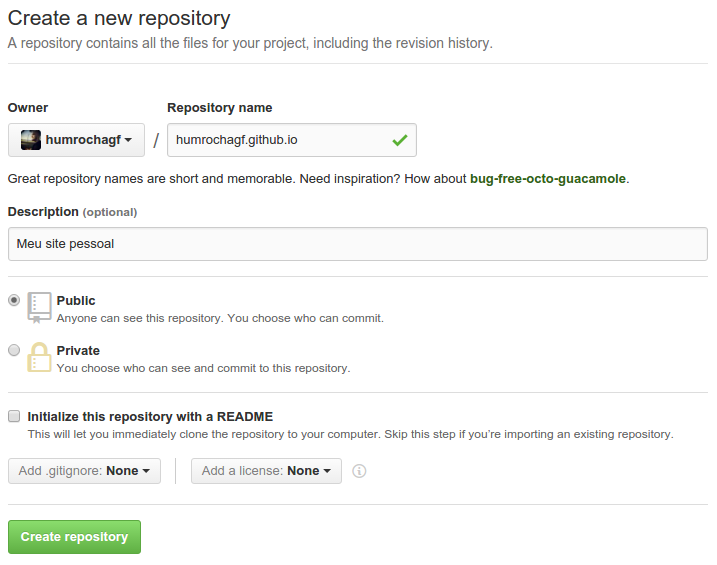
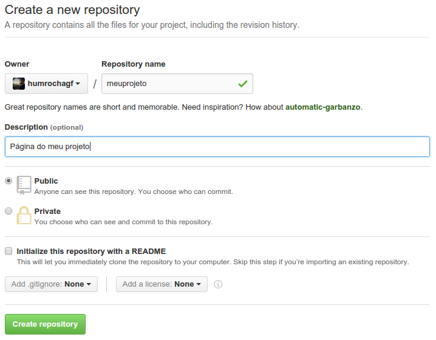
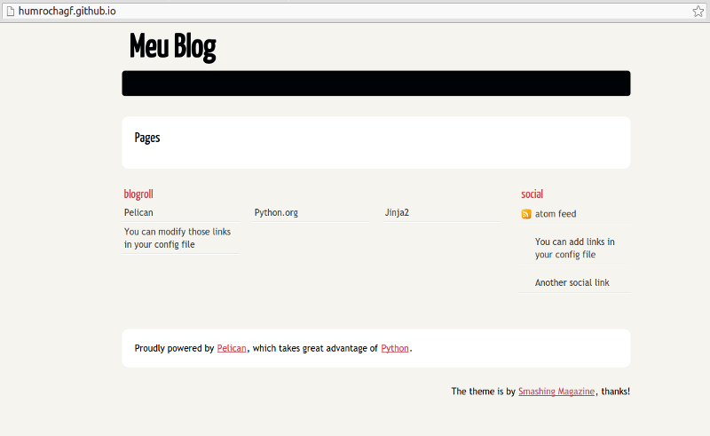
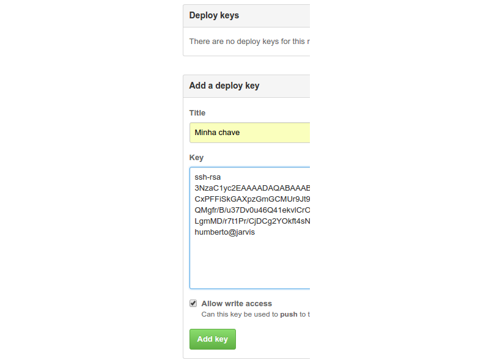
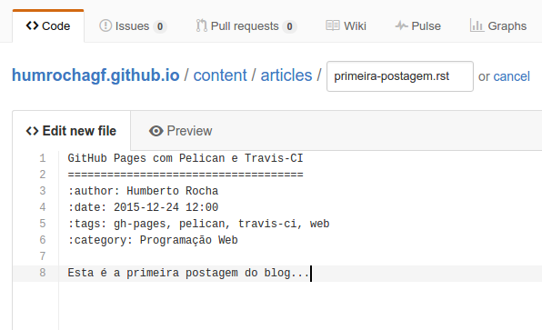
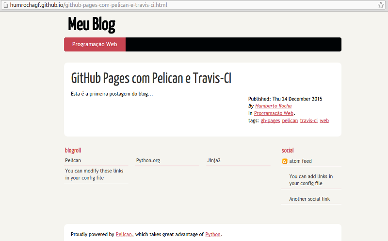

**Publicado originalmente em:** [df.python.org.br/blog/github-pages-com-pelican-e-travis-ci](http://df.python.org.br/blog/github-pages-com-pelican-e-travis-ci)

Estou fazendo esta postagem para ajudar quem quer criar seu site no [GitHub Pages](http://pages.github.com) usando [Pelican](http://blog.getpelican.com) para a criação das páginas e o [Travis-CI](https://travis-ci.org) para automatizar a tarefa de geração e publicação.

Este guia assume que o leitor possua conta no [GitHub](http://github.com) e no Travis-CI e tenha familiaridade com o ambiente python. A versão do pelican utilizada ao elaborar esta publicação foi a 3.6.

## O GitHub Pages

O GitHub Pages é uma funcionalidade gratuita do GitHub para hospedar conteúdo estático (html, css, js e imagens) e publicar através de um sub-domínio de **github.io** ou até mesmo de um domínio customizado.

É baseado em seu funcionamento que iremos guiar nossos próximos passos.

Resumidamente existem duas formas de se criar uma página pelo gh pages:

**1 - Página de usuário/organização**

Para este tipo de página crie um repositório com o nome `usuario.github.io`, onde `usuario` é o nome de usuário ou organização da conta em que o repositório será criado:



O conteúdo a ser publicado deve ser colocado na **branch master** e os arquivos do pelican na **branch pelican**.

**2 - Página de projeto**

Para este tipo de página crie um repositório com o nome `meuprojeto`, onde `meuprojeto` é o nome desejado para o projeto que será publicado em `usuario.github.io`:



O conteúdo a ser publicado deve ser colocado na **branch gh-pages** e os arquivos do pelican na **branch pelican**.

Para mais informações acesse o site oficial do [GitHub Pages](http://pages.github.com).

## Pelican

O pelican é um gerador de site estático otimizado por padrão para criação de blogs. Utilizaremos aqui, para fins de demonstração, o modelo padrão do de blog seguindo o caminho de criação de página de usuário/organização, qualquer diferença do caminho de página de projeto será descrita quando necessário.

Para instalar o pelican basta rodar o comando:

```console
$ pip install pelican==3.6
```

Para criar um projeto faça:

```console
$ mkdir humrochagf.github.io
$ cd humrochagf.github.io
$ pelican-quickstart
Welcome to pelican-quickstart v3.6.3.

This script will help you create a new Pelican-based website.

Please answer the following questions so this script can generate the files
needed by Pelican.


> Where do you want to create your new web site? [.]
> What will be the title of this web site? Meu Blog
> Who will be the author of this web site? Humberto Rocha
> What will be the default language of this web site? [en] pt
> Do you want to specify a URL prefix? e.g., http://example.com   (Y/n) n
> Do you want to enable article pagination? (Y/n) y
> How many articles per page do you want? [10]
> What is your time zone? [Europe/Paris] America/Sao_Paulo
> Do you want to generate a Fabfile/Makefile to automate generation and publishing? (Y/n) y
> Do you want an auto-reload & simpleHTTP script to assist with theme and site development? (Y/n) y
> Do you want to upload your website using FTP? (y/N) n
> Do you want to upload your website using SSH? (y/N) n
> Do you want to upload your website using Dropbox? (y/N) n
> Do you want to upload your website using S3? (y/N) n
> Do you want to upload your website using Rackspace Cloud Files? (y/N) n
> Do you want to upload your website using GitHub Pages? (y/N) y
> Is this your personal page (username.github.io)? (y/N) y
Done. Your new project is available at /caminho/para/humrochagf.github.io
```

Inicialize um repositório neste diretório e suba os dados para a **branch pelican**:

```console
$ git init
$ git remote add origin git@github.com:humrochagf/humrochagf.github.io.git
$ git checkout -b pelican
$ git add .
$ git commit -m 'iniciando branch pelican'
$ git push origin pelican
```

Para publicar o conteúdo na **branch master** é necessário o módulo `ghp-import`:

```console
$ pip install ghp-import
$ echo 'pelican==3.6\nghp-import' > requirements.txt
$ git add requirements.txt
$ git commit -m 'adicionando requirements'
$ git push origin pelican
```

Publicando o blog:

```console
$ make github
```




Para publicar no caso da página de projeto altere o conteúdo da variável `GITHUB_PAGES_BRANCH` do makefile de `master` para `gh-pages`.


Agora que o nosso blog está rodando no gh pages vamos automatizar a tarefa de geração das páginas para poder alterar o conteúdo do blog e fazer novas postagens sem precisar estar um uma máquina com o ambiente do pelican configurado.

## Travis-CI

O Travis-CI é uma plataforma de Integração Contínua que monta e testa projetos hospedados no github e será nossa ferramenta para automatizar a montagem das páginas do blog.

A Primeira coisa a ser feita é ir ao Travis-CI e habilitar seu repositório.


Em seguida vá nas configurações do repositório no travis e desabilite a opção **Build pull requests** para seu blog não ser atualizado quando alguém abrir um pull request e habilite o **Build only if .travis.yml is present** para que somente a branch que possuir o arquivo .travis.yml gerar atualização no blog.


O próximo passo é criar uma **Deploy Key** para que o travis possa publicar conteúdo no github. Para isso gere uma chave ssh na raiz do repositório local:

```console
$ ssh-keygen -f publish-key
Generating public/private rsa key pair.
Enter passphrase (empty for no passphrase):
Enter same passphrase again:
Your identification has been saved in publish-key.
Your public key has been saved in publish-key.pub.
```

Criada a chave vamos cifrar usando a ferramenta [Travis-CLI](https://github.com/travis-ci/travis.rb) (certifique-se de que esteja instalada em sua máquina) para poder publicar em nosso repositório sem expor o conteúdo da chave privada:

```console
$ travis encrypt-file publish-key
Detected repository as humrochagf/humrochagf.github.io, is this correct? |yes| yes
encrypting publish-key for humrochagf/humrochagf.github.io
storing result as publish-key.enc
storing secure env variables for decryption

Please add the following to your build script (before_install stage in your .travis.yml, for instance):

    openssl aes-256-cbc -K $encrypted_591fe46d4973_key -iv $encrypted_591fe46d4973_iv -in publish-key.enc -out publish-key -d

Pro Tip: You can add it automatically by running with --add.

Make sure to add publish-key.enc to the git repository.
Make sure not to add publish-key to the git repository.
Commit all changes to your .travis.yml.
```

Como dito no resultado do comando podemos adicionar a opção `--add` para já adicionar as informações no `.travis.yml`, porém, para evitar de sobrescrever algum comando que venha existir no seu arquivo é recomendado editar manualmente.

Em nosso caso iremos criar o arquivo:

```console
$ touch .travis.yml
```

E adicionar o seguinte conteúdo:

```yaml
sudo: false
branches:
  only:
  - pelican
language: python
before_install:
# troque a linha abaixo pelo resultado do comando:
# travis encrypt-file publish-key
# porém mantenha o final:
# -out ~/.ssh/publish-key -d
- openssl aes-256-cbc -K $encrypted_591fe46d4973_key -iv $encrypted_591fe46d4973_iv -in publish-key.enc -out ~/.ssh/publish-key -d
- chmod u=rw,og= ~/.ssh/publish-key
- echo "Host github.com" >> ~/.ssh/config
- echo "  IdentityFile ~/.ssh/publish-key" >> ~/.ssh/config
# substitua git@github.com:humrochagf/humrochagf.github.io.git
# pelo endereço de acesso ssh do seu repositório
- git remote set-url origin git@github.com:humrochagf/humrochagf.github.io.git
# Caso esteja montando a página de projeto troque master:master
# por gh-pages:gh-pages
- git fetch origin -f master:master
install:
- pip install --upgrade pip
- pip install -r requirements.txt
script:
- make github
```

Removemos em seguida a chave privada não cifrada para não correr o risco de publicar no repositório:

```console
$ rm publish-key
```


**ATENÇÃO**: Em hipótese alguma adicione o arquivo **publish-key** em seu repositório, pois ele contém a chave privada não cifrada que tem poder de commit em seu repositório, e não deve ser publicada. Adicione somente o arquivo **publish-key.enc**. Se você adicionou por engano refaça os passos de geração da chave e cifração para gerar uma chave nova.


Agora adicionaremos os arquivos no repositório:

```console
$ git add .travis.yml publish-key.enc
$ git commit -m 'adicionando arquivos do travis'
$ git push origin pelican
```

Para liberar o acesso do travis adicionaremos a deploy key no github com o conteúdo da chave pública **publish-key.pub**:



Pronto, agora podemos publicar conteúdo em nosso blog sem a necessidade de ter o pelican instalado na máquina:



Que o travis irá publicar para você:



Caso você tenha animado de criar seu blog pessoal e quer saber mais sobre pelican você pode acompanhar a série do [Mind Bending](http://mindbending.org/pt/series/migrando-para-o-pelican) sobre o assunto.
