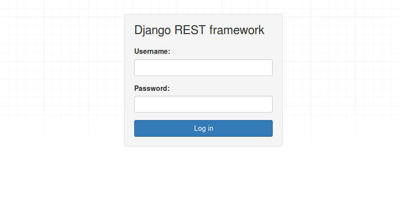
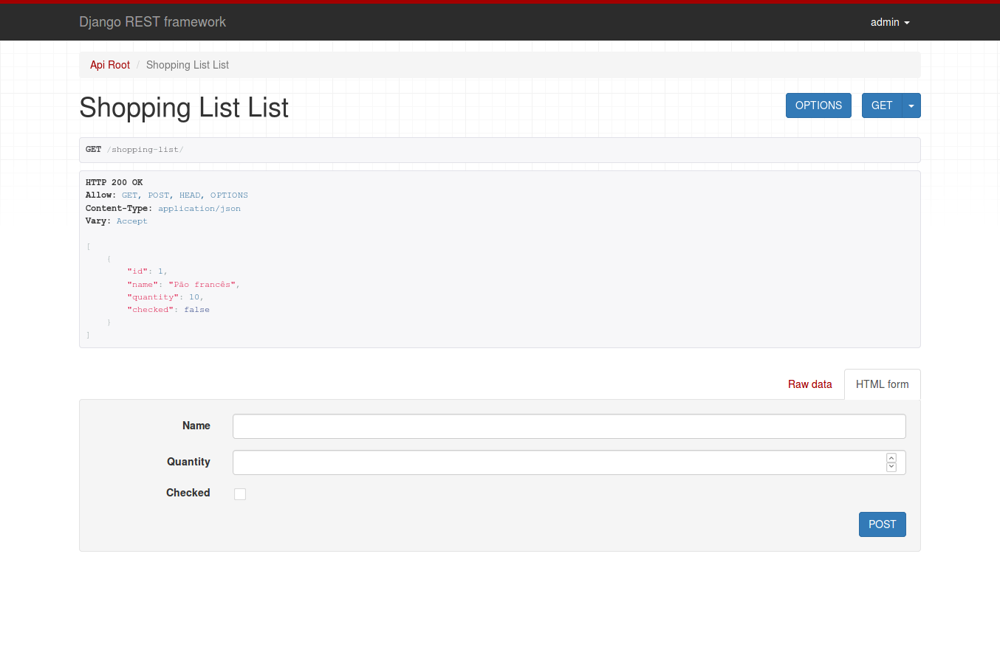
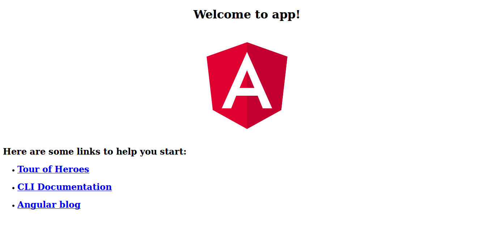

At web development, things evolve and grow in complexity faster than we can follow. That old way of creating websites where the pages were built only with HTML and if you had to change something you had to go through many pages changing the same thing is something rare nowadays. Now, even to create static websites, we use tools to optimize our work.

On the last years, we had an increase in javascript frameworks and an excellent evolution on the frontend as a whole. These new technologies have their tools and pipelines that makes harder to a single system to deliver both frontend and backend.

At the same time, the API architecture is becoming more popular, bringing the idea of giving more autonomy to the teams and making the applications more scalable.

However, the first try to implement this architecture can be hard, and many questions around that can pop out.

On this post, we'll see a simplified example to help us to put this concept in practice. We'll create an application of shopping list where we can add, retrieve, and exclude the items on the list. To do that we'll use Django 2 for the backend and Angular 6 for the frontend.

The repositories with the code for this are:

- **Backend**: [https://github.com/humrochagf/post-back-do-front-backend](https://github.com/humrochagf/post-back-do-front-backend)
- **Frontend**: [https://github.com/humrochagf/post-back-do-front-frontend](https://github.com/humrochagf/post-back-do-front-frontend)


**UPDATE (August 22, 2018)** Post updated and tested to use Angular 6


## Splitting the Responsibilities

To start, let's talk a little about the responsibilities divided through the project.

There are two significant responsibilities inside an interactive web application: the management and the visualization of the data.

## Backend

Looking to the client/server architecture, we call as the backend, the layer responsible for managing the access on the data, and its processing happens entirely on the server that is responsible for the service. The backend is responsible for accessing, processing, storing, and controlling the access to the data requested by the client. The most famous implementations of it are the REST API's.

## Frontend

On the other hand, the frontend is responsible for the presentation layer of your application, and most of the work usually happens on the client-side.

## Backend Implementation

Now that we have the responsibilities divided, let's start by writing the backend.

First, install Django and create a new project:


$ pip install django
$ django-admin startproject backend
$ cd backend
$ python manage.py migrate
$ python manage.py runserver


Then we start the browser at [localhost:8000](http://localhost:8000) to see the Django new application success screen.



The next step is to install the Django Rest Framework:


$ pip install djangorestframework


After that we edit the `settings.py` file to plug it:


INSTALLED_APPS = (
    ...
    'rest_framework',
)


At `urls.py` we add the framework authentication URLs to get access to the API interactive navigation.


from django.urls import include, path

urlpatterns = [
    ...
    path('api-auth/', include('rest_framework.urls')),
]


Now it is possible to log in by accessing [localhost:8000/api-auth/login/](http://localhost:8000/api-auth/login/).

With the authentication ready, let's start the shopping list app:


python manage.py startapp shopping


The application will be pretty straight forward with a single **model** that will represent the shopping list at the database, a **serializer** that will transform the data from the Python object into **JSON** and handle validation, and a **view** that will receive parse and answer the incoming requests:


# settings .py

INSTALLED_APPS = (
    ...
    'shopping',
)

# models.py

from django.db import models

class ShoppingItem(models.Model):

    name = models.CharField(max_length=60)
    quantity = models.PositiveSmallIntegerField()
    checked = models.BooleanField(default=False)

# serializers.py

from rest_framework import serializers

from .models import ShoppingItem

class ShoppingItemSerializer(serializers.ModelSerializer):

    class Meta:
        model = ShoppingItem
        fields = '__all__'

# views.py

from rest_framework import viewsets

from .models import ShoppingItem
from .serializers import ShoppingItemSerializer

class ShoppingItemViewSet(viewsets.ModelViewSet):

    serializer_class = ShoppingItemSerializer
    queryset = ShoppingItem.objects.all()

# urls.py

from django.urls import include, path
from rest_framework import routers

from shopping.views import ShoppingItemViewSet

router = routers.DefaultRouter()
router.register(
    'shopping-item', ShoppingItemViewSet, base_name='shopping-item'
)

urlpatterns = [
    ...
    path('', include(router.urls)),
]


Now, we need to create the database migrations and apply that to our database:


$ python manage.py makemigrations
$ python manage.py migrate


And voilá, our backend is working:

## Frontend Implementation

To start the frontend, let's install the CLI tools to create an **Angular** project:


$ npm install -g @angular/cli
$ ng new frontend
$ cd frontend
$ ng serve


Now we can access the frontend at [localhost:4200](http://localhost:4200) to see the Angular new project page.

Then we create a **service** to access the API and a **view** to list the items at the shopping list:


// shopping-item.interface.ts

export interface ShoppingItem {
  id: number;
  name: string;
  quantity: number;
  checked: boolean;
}

// api.service.ts

import { Injectable } from '@angular/core';
import { HttpClient } from '@angular/common/http';

@Injectable()
export class ApiService {

  private apiRoot = 'http://localhost:8000/';

  constructor(private http: HttpClient) { }

  getShoppingItems() {
    return this.http.get(this.apiRoot.concat('shopping-item/'));
  }
}

//  app.component.ts

import { Component, OnInit } from '@angular/core';

import { ApiService } from './api.service';
import { ShoppingItem } from './shopping-item.interface';

@Component({
  selector: 'app-root',
  template: `
  

    <h1>
      Shopping list
    </h1>
  

  <ul>
    <li *ngFor="let item of items">
      <h2>{{ item.name }}</h2>
    </li>
  </ul>
  {{ error?.message }}
  `
})
export class AppComponent implements OnInit {

  items: ShoppingItem[];
  error: any;

  constructor(private api: ApiService) { }

  ngOnInit() {
    this.api.getShoppingItems().subscribe(
      (items: ShoppingItem[]) => this.items = items,
      (error: any) => this.error = error
    );
  }
}

// app.module.ts

import { BrowserModule } from '@angular/platform-browser';
import { NgModule } from '@angular/core';
import { HttpClientModule } from '@angular/common/http';

import { ApiService } from './api.service';
import { AppComponent } from './app.component';

@NgModule({
  declarations: [
    AppComponent,
  ],
  imports: [
    BrowserModule,
    HttpClientModule,
  ],
  providers: [
    ApiService,
  ],
  bootstrap: [
    AppComponent,
  ],
})
export class AppModule { }


Accessing [localhost:4200](http://localhost:4200) we can see our beautiful shopping lis...

There is something wrong with our application, let's check the browser console:

Ding! Ding! Ding! It seems we found our problem!

# Cross-Origin Resource Sharing (CORS)

For security reasons browsers implement the [same origin policy](https://developer.mozilla.org/en-US/docs/Web/Security/Same-origin_policy), that blocks scripts that make HTTP requests with cross-origin, which is the requests that have protocol, domain, or port that differs from its origin.

To enable cross-origin requests safely the [Cross-origin resource sharing (CORS)](https://developer.mozilla.org/en-US/docs/Web/HTTP/CORS) was created, and it allows the communication between the frontend and the backend at different sources. It is also helpful to enable requests for resources stored at a CDN.

The mechanism operates by adding new **HTTP** headers on the request to describe the group of origins allowed to access that resource through the browser. It also requires that the browsers "preflight" the requests that can cause collateral effects on the server (like **POST**, **PUT**, and **DELETE**) with the **OPTIONS** request who needs approval before sending the real action.

The browser (by consequence our frontend too) is ready to deal with CORS. We only need to implement the backend part.


$ pip install django-cors-headers


After the installation we need to add its configuration at the `settings.py`:


INSTALLED_APPS = (
    ...
    'corsheaders',
)

MIDDLEWARE = [
    'corsheaders.middleware.CorsMiddleware',
    ...
]

CORS_ORIGIN_WHITELIST = (
    'localhost:4200',
)



Remember to place the `CorsMiddleware` the higher as possible at the middleware list so it can add the header before the backend parses it.


At `CORS_ORIGIN_WHITELIST` we put only the origin that we want to allow access. On our case is `localhost:4200`, but on the production environment, it will be something like `api.backend.com`.

With that done, we can go to the browser and see the communication between the frontend and the backend working \o/.

Then, to make it even cooler, let's add some interactivity to our shopping list:


// api.service.ts

import { Injectable } from '@angular/core';
import { HttpClient } from '@angular/common/http';

@Injectable()
export class ApiService {

  private apiRoot = 'http://localhost:8000/';

  constructor(private http: HttpClient) { }

  getShoppingItems() {
    return this.http.get(this.apiRoot.concat('shopping-item/'));
  }

  createShoppingItem(name: string, quantity: number) {
    return this.http.post(
      this.apiRoot.concat('shopping-item/'),
      { name, quantity }
    );
  }

  deleteShoppingItem(id: number) {
    return this.http.delete(this.apiRoot.concat(`shopping-item/${id}/`));
  }
}

//  app.component.ts

import { Component, OnInit } from '@angular/core';

import { ApiService } from './api.service';
import { ShoppingItem } from './shopping-item.interface';

@Component({
  selector: 'app-root',
  template: `
  

    <h1>
      Lista de compras
    </h1>
  

  <ul>
    <li *ngFor="let item of items">
      <h2>{{ item.quantity }}x {{ item.name }}
      <button (click)="delete(item.id)">x</button></h2>
    </li>
  </ul>

  <input #itemQuantity type='text' placeholder='Qtd'>
  <input #itemName type='text' placeholder='Name'>
  <button (click)="add(itemName.value, itemQuantity.value)">Add</button>
  {{ error?.message }}
  `
})
export class AppComponent implements OnInit {

  items: ShoppingItem[];
  error: any;

  constructor(private api: ApiService) { }

  ngOnInit() {
    this.api.getShoppingItems().subscribe(
      (items: ShoppingItem[]) => this.items = items,
      (error: any) => this.error = error
    );
  }

  add(itemName: string, itemQuantity: number) {
    this.api.createShoppingItem(itemName, itemQuantity).subscribe(
      (item: ShoppingItem) => this.items.push(item)
    );
  }

  delete(id: number) {
    this.api.deleteShoppingItem(id).subscribe(
      (success: any) => this.items.splice(
        this.items.findIndex(item => item.id === id)
      )
    );
  }
}


Now we have our shopping list done:



## Conclusion

To split the frontend to the backend into different projects generates more work when you compare it to a monolith. But, after you get used to it, you will start to see the benefits that come from this separation like the flexibility, the liberty across the teams to use their own set of tools and pipelines, and the performance improvement by delegating some of the processing to the client-side. Also, if you are a company, you get the possibility to hire specialized to evolve your platform without requiring that everyone has a full-stack knowledge upfront.
