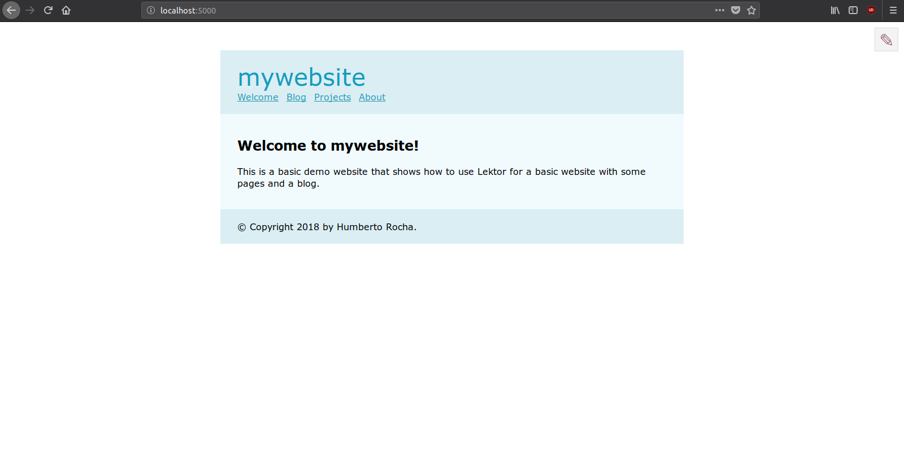
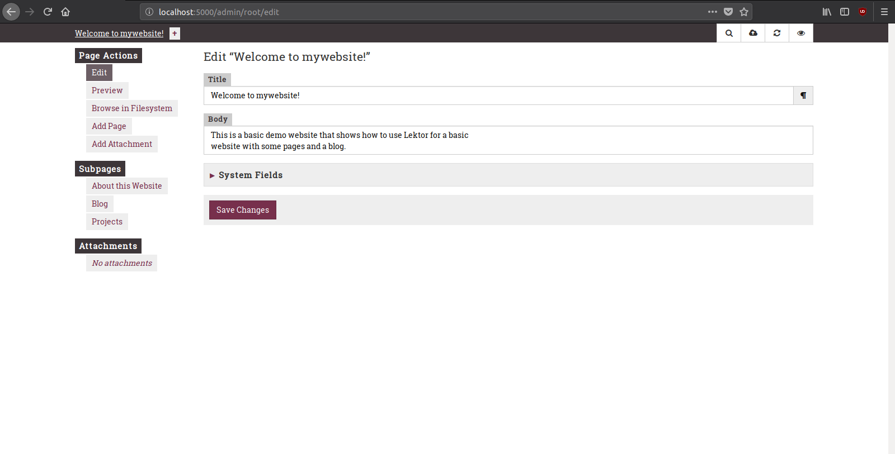

Theres about 4 years that I try to start a blog and during that time I created some for the community but never my own.

Using publishing tools like WordPress the problem was the difficulty of customizing it and the amount of tooling that I would never use, plus it's not **Python**.

Then I discovered [GitHub Pages](https://pages.github.com), and at the same time [Pelican](http://blog.getpelican.com) by indication of [Magnun Leno](http://mindbending.org/pt) and I started to do a lot things with it.

That was cool, but still, there some things that were bugging me. Even with the freedom to customize everything, the publishing was the same as the development pipeline. At first you say that this is a plus right? Yeah but that become a problem when you stop your writing because you found a bug or just seen something that can be improved and here we go again...


So a while ago, chatting with some friends at the [Brazilian Python community Telegram group](https://telegram.me/pythonbr) someone quoted **Lektor** as a new alternative to **Pelican** then my adventure at **Lektor** started.

## Lektor

[Lektor](https://www.getlektor.com) is a flexible and powerful static content management system for building complex and beautiful websites out of flat files created by [Armin Ronacher](http://lucumr.pocoo.org) (the creator of [flask](http://flask.pocoo.org)) and maintained by the community.

## Why use Lektor

As described at its [website](https://www.getlektor.com/docs/what) **Lektor** learned from content management systems like WordPress, static website generators like Pelican, web frameworks like Django and created something that balances its weak ad strong points in a tool that is:

- **Static**: The final product is a static website that allows you to host is anywhere.
- **CMS**: A local admin interface that allows a publishing pipeline different from coding easy to non programmers to use.
- **Framework**: It has a models system on plain text files and a template system with Jinja2 that creates an environment that is familiar to developers that uses Django, Flask and other Python web frameworks.
- **Deploy**: The deploy system is just a single configuration file that helps you to deploy your content to production.

## Lektor Installation

Lektor runs on python 2.7 and above and requires `python-dev`, `libssl-dev`, `libffi-dev` and `imagemagick` that you can easily install with that command if you are using Ubuntu:

```console
$ sudo apt-get install python-dev libssl-dev libffi-dev imagemagick
```


You can check for **brew** packages on Mac **chocolatey** on Windows and the other package managers for different distributions of Linux they have its versions of these packages


The installation itself is pretty straight forward:

```console
$ curl -sf https://www.getlektor.com/install.sh | sh
```

This  command installs it right into your system but if you prefer to use a virtualenv:

```console
$ virtualenv venv
$ . venv/bin/activate
$ pip install Lektor
```

This is not the recommended way of installing Lektor because of it plugin system but if you are a Python developer it will be no problem to you. If you want to contribute with Lektor development you can clone the repository and start coding by running:

```console
$ git clone https://github.com/lektor/lektor
$ cd lektor
$ make build-js
$ virtualenv venv
$ . venv/bin/activate
$ pip install --editable .
```


It requires `node` installed to mount the admin interface.


## Creating the Website

To create your website run Lektor's project creation command:

```console
$ lektor quickstart
```

It will ask some questions and then create a project with the name that you give to the command.

### Structure

This is the basic structure of a project generated by Lektor:

```console
mywebsite
├── assets/
├── content/
├── templates/
├── models/
└── mywebsite.lektorproject
```

- **assets**: Folder were the .css, .js, .ico and other static assets called by the templates will be placed.
- **content**: Folder to store the markdown files with the content that will be parsed into the static pages.
- **templates**: Folder with the html files used by the template system.
- **models**: Folder for the files that define the website data modeling.
- **meusite.lektorproject:** File with the website global settings.

### Running the project

To run the website on your machine just go to the project folder and start the local server:

```console
$ cd mywebsite
$ lektor server
```

With the server running access [localhost:5000](http://localhost:5000) to see the result:



### Accessing the Admin

To access the admin interface just click at the pencil icon at the top right corner of the page that you opened or go to [localhost:5000/admin](http://localhost:5000/admin):



## Publishing the Website

There is two ways to deploy a website built with Lektor, the manual way, witch is running the command `build` and copying manually the files to the server trough an FTP or SSH connection:

```console
$ lektor build --output-path output
```

And the automatic way, that can be done by adding the following configuration at the `.lektorproject` file on the GitHub Pages case:

```ini
[servers.production]
target = ghpages://user/repo
```


The deploy will make a force push ath the `master` or `gh-pages` branch based on the type of repository, so watch out to not override your data. Keep the source code at a separate branch. You can check my repository at [github](https://github.com/humrochagf/humberto.io-lektor) to see how its configured.


Or at the cloud hosted case:

```ini
[servers.production]
name = Production
target = rsync://user@server.domain.com/srv/mywebsite/www
```

And running the command:

```console
$ lektor deploy
```

To get more information about Lektor check out the [official documentation website](https://www.getlektor.com/docs) and also stay tuned for the next posts.
